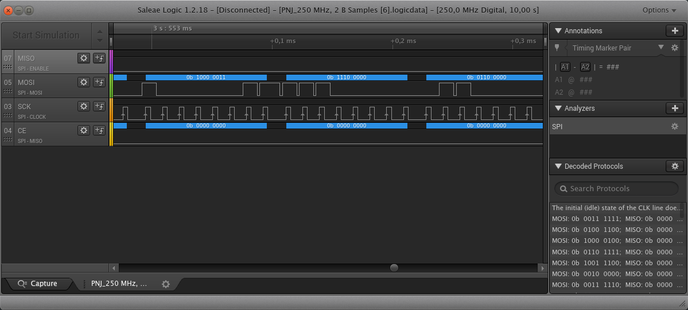

# Identification des controleurs
## Drone
Il y a une inscription UD U17B et une référence à 2013 sur la carte mère du drone.

Un peu de recherche sur internet nous insique:

- https://www.rcgroups.com/forums/showthread.php?2069017-Hacking-STM8-RFM73-based-micros-UDI816-yd717-Sky-Botz
- https://www.deviationtx.com/forum/protocol-development/2551-udi-r-c-u816-u818-protocol

```
// Known UDI 2.4GHz protocol variants, all using BK2421
//  * UDI U819 coaxial 3ch helicoper
//  * UDI U816/817/818 quadcopters
//    - "V1" with orange LED on TX, U816 RX labeled '' , U817/U818 RX labeled 'UD-U817B'
//    - "V2" with red LEDs on TX, U816 RX labeled '', U817/U818 RX labeled 'UD-U817OG'
//    - "V3" with green LEDs on TX. Did not get my hands on yet.
//  * U830 mini quadcopter with tilt steering ("Protocol 2014")
//  * U839 nano quadcopter ("Protocol 2014")
```
Il y a aussi une puce ARM et une autre puce avec une inscription difficile à lire.

## Télécommande
Une grande puce sans inscription sur laquelle arrivent les boutons et partent des pistes vers le tranceiver RF.

Le tranceiver est soudé à la carte mère à 90°. Il y a 8 points de soudures assez facilement accessibles. Surement un bus SPI. On peut y souder des fils pour pouvoir mettre un analyseur logique.

## Tranceiver RF
On note que ce sont les mêmes puces sur la télécommande et sur le drone. Une inscription dessus mais illisible à cause d'un gros point de colle. L'inscription est à côté ded ce qui semble être le cristal.

Le circuit ressemble très fortement à celui ci: https://www.hackster.io/geekphysical/controlling-toy-quadcopter-s-with-arduino-6b4dcf

On peut donc supposer que c'est une puce [BK2421](http://www.bekencorp.com/en/Botong.Asp?Parent_id=2&Class_id=8&Id=13)

# Analyse du bus SPI

## Connexion au bus

On soude sur la télécommande des fils qui vont nous permettre de connecter ce qu'on suppose être un bus SPI à un analyseur logique.

Nous choissons les couleurs suivantes:
- CSN: Blanc
- CE: Jaune
- MISO: Gris
- IRQ: Non connecté
- MOSI: Vert
- SCK: Orange

## Analyse



L'analyseur logique nous confirme bien que nous avons un bus SPI. En rajoutant un analyseur, nous pouvons voir ce qui passe sur le bus et le [comparer à la spec du module BK2421](Dump\ SPI\ Init\ Manette.ods).


On voit que cela semble bien correspondre. Une analyse avec un SDR nous confirme de l'activité sur les canaux 70, 63, 56 et 48.