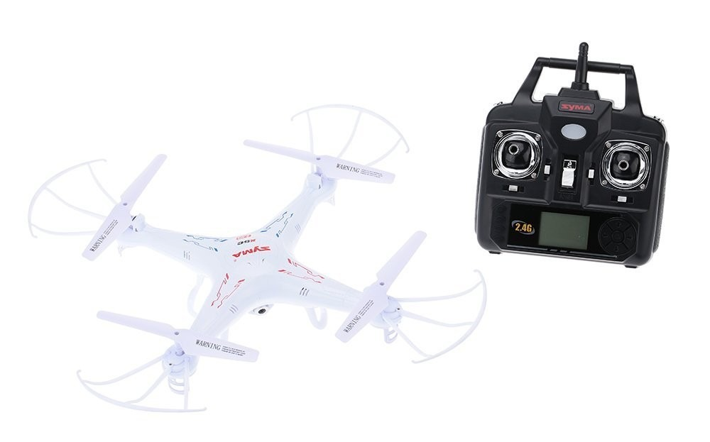

# Attaque Syma X5C-1
## Présentation de l'attaque
Le Syma X5C-1 est un petit drone RF opérant sur 3 canaux dans la bande de fréquence 2.4 GHz. Il se pilote via une télécommande.



Une attaque, dont les détails ont été publiés sur le blog *ptsecurity*^[<https://blog.ptsecurity.com/2016/06/phd-vi-how-they-stole-our-drone.html>], a déjà été menée sur ce drone. Nous avons cherché à rejouer la même attaque pour la comprendre et l'embarquer sur le drone prédateur.

Afin de pouvoir détourner le drone en vol, il est nécessaire de:
- Découvrir les canaux utilisés
- Découvrir la modulation utilisée et décoder les trames du protocole
- Interpréter la trame du protocole afin de faire le lien avec les positions des joystick de la télécommande
- Implémenter le protocole avec une puce radio émettrice

> Pour simplifier le contrôle du drone après l'attaque, nous avons choisi d'utiliser une manette de jeu USB comme contrôleur.

Une fois les étapes ci-dessus réalisées, nous avons pu constater que la télécommande légitime n'a quasiment plus d'effet sur le drone. Cela s'explique par la fréquence d'émission des trames. En effet, notre implémentation du protocole émet beaucoup plus de trames que la télécommande légitime.

Le drone reçoit donc à la fois les ordres légitimes et les ordres de l'attaquant. Il essaye de tous les exécuter. Comme l'attaquant envoie beaucoup plus de trames, c'est lui qui possède le contrôle dans les faits.

## Compréhension de la couche physique

Ce chapitre détaille les étapes qui ont été nécessaires afin de comprendre la couche physique utilisée par le drone.

### Découverte des canaux utilisés

Nous avons utilisé une radio logicielle (SDR USRP B200) avec le logiciel GnuRadio.

> Un SDR (*Software-Defined Radio*) est un équipement qui permet de recevoir et émettre des signaux radios. Contrairement à une puce radio classique, le SDR ne fait aucune modulation/démodulation ni aucun traitement. Celui-ci est réalisé par un ordinateur relié au SDR.

> GnuRadio est un logiciel qui permet de construire des chaînes de traitement radio. Il permet des traitements très complexes. La chaîne peut être construite graphiuement avec l'application GnuRadio Companion.


Nous avons donc parcouru la bande de fréquence entre 2.400 GHz et 2.525 Ghz avec Gnuradio. Cela correspond à la plage de fréquences gérables par un nRF24l01 (la puce que l'on souhaite utiliser pour prendre le contrôle du drone).

Pour cela nous avons créé une waterfall et avons rapidement constaté de l'activité autour **2.410 GHz**. Pour préciser notre observation, nous avons rajouté une FFT^[*Fast Fourier Transform*, ou transformation de Fourier Rapide] avec Gnuradio autour de cette fréquence. Après avoir bien centré notre FFT, nous avons pu relever une **bande passante autour de 800kHz**.


> \itodo{Ajouter image waterfall et FFT}

En regardant un extrait de la *datasheet* d'un module radio nRF24l01^[<https://framagit.org/tigre-bleu/predator-drone/blob/master/doc/nRF24L01+/nRF24L01Pluss_Preliminary_Product_Specification_v1_0.pdf>], on peut lire:

```
6.3 RF channel frequency
------------------------

The RF channel frequency determines the center of the channel used by the nRF24L01+. The channel occupies a bandwidth of less than 1MHz at 250kbps and 1Mbps and a bandwidth of less than 2MHz at 2Mbps. nRF24L01+ can operate on frequencies from 2.400GHz to 2.525GHz. The programming resolution of the RF channel frequency setting is 1MHz.

At 2Mbps the channel occupies a bandwidth wider than the resolution of the RF channel frequency setting. To ensure non-overlapping channels in 2Mbps mode, the channel spacing must be 2MHz or more. At 1Mbps and 250kbps the channel bandwidth is the same or lower than the resolution of the RF frequency.

The RF channel frequency is set by the RF_CH register according to the following formula:

F0 = 2400 + RF_CH [MHz]

You must program a transmitter and a receiver with the same RF channel frequency to communicate with each other.
```

En supposant que le chipset du drone est similaire à un nRF24l01, on voit qu'avec 800 kHz de bande passante, nous avons un **débit de 250 Kbps ou 1 Mbps** mais certainement pas de 2 Mbps.

Nous avons ensuite utilisé la formule suivante pour trouver le canal $\texttt{F0} = 2400 + \texttt{RF_CH}$. Le résultat est $2410 - 2400 = 10$ donc le canal utilisé est le canal 10.

En appliquant cette méthode sur les autres fréquences, nous avons constaté de l'activité sur les canaux : **10, 31, 42 et 66**.

### Découverte de la modulation

Nous avons pris l'hypothèse que les quatre canaux sont utilisés de manière identique et nous nous concentrons alors sur le canal 10.

Nous avons donc créé un autre traitement GnuRadio pour enregistrer le signal en sortie de l'USRP.


Puis, nous avons ouvert cet enregistrement avec le logiciel `baudline`, afin de le visualiser.


Nous avons constaté que l'amplitude du signal est constante, ce n'était donc pas de l'ASK. Il était légitime de penser que la modulation était du FSK/GFSK mais cela aurait aussi pu être du PSK.

Nous avons rajouté un filtre passe-bas afin d'avoir un signal plus propre, puis un bloc `Quadrature Demod` permettant de séparer les fréquences.


Nous avons alors pu voir les bits de notre signal :


La fin du traitement GnuRadio enregistre dans un fichier des bits pris à une période constante correspondante à 250 kbits/s. Nous y avons donc retrouvé nos trames mais aussi de "faux bits" issus de la mauvaise interprétation du bruit.


> **Remarque :**
> Pour être plus propre, nous aurions pu développer une chaine de démodulation complète permettant de synchroniser l'horloge et de filtrer le bruit entre plusieurs messages. Cependant ce n'était pas strictement nécessaire pour réaliser notre attaque.

## Compréhension de la couche liaison de données

Une fois la modulation déterminée, il nous a fallu comprendre le fonctionnement de la couche liaison de données.

### Première impression

En regardant de plus près notre signal démodulé, nous avons observé les éléments suivants:


- Du bruit
- Une phase ou le signal se stabilise, probablement l'initialisation de l'émetteur
- Une suite de 1 et de 0 alternés, probablement 1 octet de préambule `0xAA`
- Une série de bits, probablement les bit de données
- Du bruit

Le nombre d'octets total (incluant le préambule) semblait donc être de 18.

> Il est bon de noter que la présence d'un octet de préambule n'est pas surprenante. Il est courant pour un émetteur de transmettre un préambule de 1 et de 0 alternés afin que le récepteur puisse synchroniser son horloge interne sur celle de l'émetteur.

On peut voir dans la specification du module radio nRF24l01+ que celui-ci émet un préambule de `0xAA` ou `0x55`. Il est donc légitime de penser que le drone utilise un module de ce type. Il s'agit en effet d'un module bon marché très utilisé pour des petits équipements électroniques: drones, souris sans fil, etc.

### Module nRF24l01+

À ce stade, nous nous sommes intéressés plus en détail au fonctionnement du module nRF24l01+. C'est en effet un module radio très populaire faisant du GFSK sur la bande 2.4 GHz. Il est utilisé dans beaucoup de projets électroniques : drones mais aussi souris sans-fil, projets DIY, etc. En voici les caractéristiques les plus importantes pour notre projet:
- Il utilise un préambule en émission de type `Ox55` ou `0xAA`
- Une adresse `Tx` ou `Rx` est configurable entre 3 et 5 octets
- Deux couches de liaison de données en mode paquet sont possibles :
  - Le mode basique ;
  - Le mode *Enhanced Shockburst*, qui propose des fonctionnalités supplémentaires tels que des acquittements et de la reprise sur erreur.
- La taille de la *payload* est configurable entre 0 et 32 octets
- Un CRC est optionnel (sur 1 ou 2 octets)


Ainsi, **nous avons supposé que le drone Syma utilisait un module de type nRF24l01+ ou compatible**. Il nous fallait alors trouver la taille des champs configurables. Pour cela, il nous fallait donc écouter sur un des canaux utilisés par la télécommande.

Nous savions déjà qu'il y avait 18 octets de bits utiles dont 1 octet de préambule. Nous en concluions donc que :
- L'adresse ferait entre 3 et 5 octets
- Le CRC ferait entre 0 et 3 octets
- La *payload* ferait entre 10 et 14 octets

### Déterminaison des paramètres du procole nRF24l01+

**Méthode 1: analyse en temps différé avec un SDR**

Nous sommes partis du fichier de bits enregistré par GnuRadio en utilisant un outil déjà disponible sur GitHub^[<https://github.com/chopengauer/nrf_analyze/blob/master/nrf24_analyzer.py>] qui assiste dans cette tâche.

Ce script recherche le préambule `0xAA` puis affiche les octets qui suivent en fonction de taille de champs configurable. Il est ainsi possible de faire des hypothèses sur la taille des champs, par exemple : l'adresse est sur 3 octets, la *payload* sur 13 et le CRC sur 1. L'outil recalcule le CRC ce qui permet de vérifier en partie si nos hypothèses sont correctes ou non.

L'outil permet également de trouver de façon partiellement automatique la taille de la *payload* et la taille du CRC.

L'image ci-dessous donne la sortie du script avec les options suivantes :

```python
addr_len = 3

find_addr = True
show_badCRC = False
show_crc16 = True
show_crc8 = True
show_shockburst = False
show_simple = True
brute_len = True
```

Avec ces options, on fait l'hypothèse que l'adresse est sur 3 octets puis le script essaye toutes les combinaisons de taille de *payload* et de CRC possibles. Si un CRC calculé correspond à un CRC reçu alors il affiche la trame.


On constate qu'il y a beaucoup de "fausses trames" provenant du bruit et pour lesquelles le CRC est valide, par hasard. Hors, nous savons que la *payload* fait entre 10 et 14 octets ce qui nous permet de filtrer une grande partie des fausses trames. Parmis celles qui restent, on remarque rapidement que la même trame se répète. Nous avons donc identifié la vraie trame parmi le bruit.

La combinaison adresse de 3 octets (`0xa1ca20`) et *payload* de 12 octets est donc une combinaison possible, mais elle n'est pas la seule. En effet, l'adresse pourrait être sur 4 octets (`0xa1ca2016`) avec une *payload* sur 11 octets ou encore être sur 5 octets (`0xa1ca201770`) avec une *payload* sur 10 octets.

On observe rapidement, en utilisant la télécommande, que les 5 premiers octets restent fixes quelle que soit la position des commandes. Nous pouvons donc en déduire les caractéristiques suivantes : **adresse de 5 octets (0xa1ca201670), *payload* de 10 octets et CRC de 2 octets**.


**Méthode 2: analyse en temps réel avec un nRF24l01+**

Un attaquant n'ayant pas de SDR et supposant, à raison, que le drone utilise un protocole de type nRF24l01+ pourrait tout de même retrouver les tailles des champs et la valeur de l'adresse en utilisant un simple module nRF24l01+. Il faudrait pour cela qu'il écoute tout le traffic radio sur chaque canal et qu'il essaye d'y reconnaitre des trames valides.

Il serait alors nécessaire que le module soit capable de passer en mode *promiscuous*, ce qui n'est pas officiellement supporté. Cependant, il est possible d'arriver à ce résultat en combinant certaines propriétés du module.

> **Pseudo-mode *promiscuous* avec un nRF24l01+**
> Le module possède les carastéristiques suivantes:
> - Le préambule n'est pas utilisé à la réception d'un message. Le module se contente de rechercher son adresse sur le canal pour trouver le début d'une trame qui lui est destinée
> - La partie juste avant le préambule (`Tx init`) est, la plupart du temps, interprétée comme `0x00`
> - Le registre de configuration de la taille de l'adresse autorise les valeurs `0x01`, `0x10` et `0x11` pour des tailles de 3, 4 et 5 octets. La valeur `0x00` est interdite dans la *datasheet* du module. Pourtant, si on met `0x00` dans ce registre, on constate que le module considère une adresse de 2 octets.
>
> 
>
> En combinant ces trois propriétés, on peut configurer une adresse de `0x00AA` (2 octets) qui va correspondre à tous les débuts de trames possibles.
>
> Il faut tout de même noter une limitation de cette méthode: si la trame fait la taille maximale supportée^[39 octets : adresse de 5 octets, *payload* de 32 octets et CRC de 2 octets], il sera impossible de récupérer les 2 derniers octets de CRC car le module retournera 39 octets en partant de 0x00AA.

Nous n'avons pas réellement mis en pratique cette méthode, connaissant déjà toutes les informations nécessaires via la méthode 1, qui est plus simple.

## Compréhension du protocole Syma
Nous avons ainsi déterminé que l'adresse fait 5 octets et que la *payload* fait 10 octets. Il nous faut donc à présent comprendre le contenu de ces 10 octets de *payload*.

Pour cela, nous avons monté un nRF24l01+ sur un Raspberry Pi 3 et adapté un script existant permetant d'afficher dans une console en temps réel le contenu des *payload*^[<https://framagit.org/tigre-bleu/predator-drone/blob/master/tools/syma_protocol_analyser/syma_protocol_analyser.py>].

Pour faciliter l'interaction avec le public lors du tutoriel de la THCon, nous avons rajouté un petit écran OLED sur bus I2C afin d'y afficher le contenu des trames.


> **Remarque :** la performance de l'ensemble avec l'écran n'est pas suffisante pour faire les observations confortablement donc celui-ci n'a été utilisé que pour la THCon.

En observant les paquets émis par la télécomande alors qu'on bouge les joysticks ou actionne les boutons, nous avons vite observé que:
- Les octets 1 à 4 bougent suivant les 2 axes de chaque joystick
- Les octets 5 à 9 bougent en fonctions des appuis sur les boutons (trims, modes de la télécommande et actions sur la caméra)
- L'octet 10 bougent dès que l'un des bits des 9 premiers octets changent. Ce comportement nous a fait penser à celui d'une somme de contrôle.

En affinant un peu plus notre compréhension, nous avons conclu que;
- Octet 1 = Altitude (`0x00` -- `0xFF`)
- Octet 2 = Tangage (Avant: `0x00` -- `0x7F` / Arrière: `0x80` -- `0xFF`)
- Octet 3 = Roulis (Gauche: `0x00` -- `0x7F` / Droite: `0x80` -- `0xFF`)
- Octet 4 = Lacet (Gauche: `0x00` -- `0x7F` / Droite: `0x80` -- `0xFF`)
- Octet 5 à 9 = Trims, Mode, etc. donc peu utiles pour notre attaque
- Octet 10 = Un pseudo CRC construit comme le XOR des 9 premiers octets auquel on ajoute 0x55


Nous avons ainsi compris entièrement le protocole et sommes donc en mesure de le réimplémenter en émission pour usurper une télécommande.

## Implémentation du protocole

Il est relativement simple d'implémenter le protocole en Python sur un RPi avec un module nRF24l01+. Afin de simplifier le contrôle du drone, nous choisissons d'utiliser une manette USB. Nous sommes parti d'un code existant^[<https://github.com/chopengauer/nrf_analyze/blob/master/syma_joy.py>] que nous avons simplifié et adapté pour fonctionner avec notre manette.

Après implémentation de notre script d'attaque, nous avons observé que si le drone était allumé mais que la télécommande ne l'était pas, le drone clignotait et ne prenait pas en compte nos commande. Nous en avons conclu qu'il y avait un appairage du drone et de la télécommande. Il faudrait creuser cet aspect mais pour réaliser l'attaque souhaitée, nous n'en avions pas besoin. En effet nous souhaitons intercepter le drone en vol, donc déjà appairé à une télécommande.

Lorsque le drone était appairé avec sa télécommande originale, nous avons observé que les ordres envoyés par le RPi l'emportent sur ceux de la télécommande : **l'attaque fonctionne**.

## Caractérisation de l'attaque

L'attaque fonctionne car le Raspberry émet plus de trames que la télécommande légitime. Le drone reçoit des trames contradictoires mais valides des deux émetteurs et cherche à obéir aux deux ordres. L'attaquant envoyant plus d'ordres que le pilote légitime, c'est lui qui l'emporte.

Pour visualiser ce phénomène, nous avons développé un simple outil de log^[<https://framagit.org/tigre-bleu/predator-drone/tree/master/tools/nrf24_logger>] pour un Raspberry Pi avec un nRF24l01+ qui enregistre les trames reçues sur un canal. On peut ensuite tracer des courbes avec Gnuplot ou LibreOffice.


On voit très nettement l'augmentation du nombre de trames pendant l'attaque.

Nous avons également remarqué un phénomène qui nous avait échappé jusqu'alors: la télécommande émet 2 trames sur un canal avant de passer au canal suivant. Notre script d'attaque n'utilise pas le même algorithme et émet une seule fois sur chaque canal. En pratique, cette différence n'a pas d'effet. Cela est probablement dû au fort taux d'émission de trame par notre script attaquant.

A partir du log enregistré, nous pouvons aussi recalculer des taux de trames par seconde reçus par le drone avant et pendant l'attaque:
- Environ 50 trames/s par canal (200 trames/s au total) envoyées hors attaque
- Environ 250 trames/s par canal (1000 trames/s au total) envoyées pendant l'attaque


> Ces taux de trames sont indicatifs, car on pourrait avoir atteint les limites de performance du nRF24l01+ en réception. La grande variation du taux pendant l'attaque nous semble confirmer cette hypothèse. Néanmoins nous pensons que l'ordre de grandeur est correct.

Nous avons également visualisé la différence de nombre de trames dans GnuRadio. Pour voir ces résultats, nous vous invitons à voir la fin de la vidéo^[<https://pe.ertu.be/video-channels/tls_sec/videos>] que nous avons faite dans la volière de l'ENAC.

Une caractérisation plus rigoureuse de l'attaque nécéssiterait de passer par GnuRadio et de créer un traitement capable de compter les trames Syma.

## Détection et prévention de l'attaque

L'attaque peut être difficile à comprendre du point de vue du pilote qui perds le contrôle d'un seul coup sans aucune indication d'un quelconque problème. En effet, si l'attaquant est suffisamment fin pour mettre sa manette dans une position proche de la position courante du drone, on ne note aucune interférence sur le drone (il ne tombe pas).

Un observateur disposant d'un SDR ou d'un moniteur spécialement développé (sur le principe de notre outil de log radio) pourrait facilement constater qu'une attaque est en cours en observant un nombre de trames beaucoup plus élevé que la normale.

Il n'y a pas de moyen de protection simple et efficace contre cette attaque.

On pourrait imaginer brouiller les canaux du drone mais le contrôle serait perdu pour tout le monde. La seule solution serait d'avoir un brouillage extrêmement précis qui s'interromprait uniquement le temps d'émettre une trame légitime. Nous n'avons pas de connaissances suffisament précises dans ce domaine pour juger de la possibilité d'un tel brouillage. Ce serait une direction à creuser par la suite.

On pourrait également imaginer une "contre attaque": si une attaque est détectée, le pilote légitime augmente aussi le nombre de trames envoyées via un outil similaire à notre prédateur. Le résultat d'une telle bataille est difficile à prévoir car il pourra y avoir des collisions sur les trames. Le plus probable est que le contrôle du drone soit perdu pour tout le monde.
