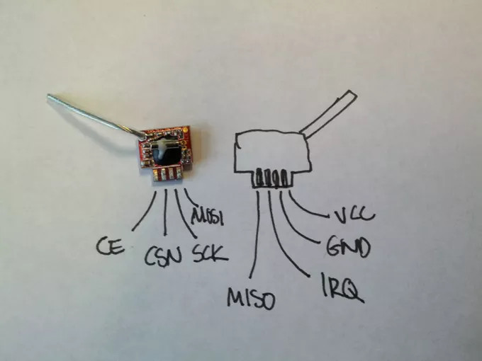

\pagebreak

# Introduction

## Introduction généraliste sur les drones

Les UAVs (*Unmanned Aerial Vehicles*), communément appelés drones, sont des aéronefs sans
pilote humain à bord. Un drone est un composant d'un UAS (*Unmanned Aircraft System*), qui
comprend un UAV, une station de contrôle au sol et un système de communication entre les
deux.

Les UAVs étaient, à l'origine, développés par les militaires et utilisés pour des missions
trop dangereuses pour les humains. Cependant, ces dernières années, leur utilisation s'est
généralisée à beaucoup de secteurs, tels que l'industrie ou les loisirs. Des exemples
concrets d'utilisations sont la surveillance de réseaux électriques, de voies
ferrées ou la photographie aérienne.

Leur champ d'utilisation est en croissance continue. En effet, les drones pourraient nous
aider lors de scénarios de secours, par exemple, en étant utilisés par les pompiers pour
un suivi en temps réel par images thermiques d'un feu. En outre, certaines entreprises,
telles qu'Amazon, envisagent d'effectuer des livraisons par drone.


## Motivations de ce travail

Bien que les précédents cas d'usage civils soient bénéfiques, d'autres usages peuvent
exister... En effet, un cas concret concernant tout le monde est celui d'une personne qui
utiliserait un drone pour vous espionner, en survolant votre maison et passant proche de
vos fenêtres. Une autre utilisation, plus grave, est l'utilisation, par Daesh, de drones
civils pour larguer des bombes sur le front en Syrie. Enfin, plus récemment, l'aéroport de
Londres Gatwick a été fermé pour cause de survols répétés par un drone non identifié.

Ainsi, il devient nécessaire de pouvoir se protéger des drones. Du côté militaire, des
solutions existent déjà, telles que le brouillage de la liaison de commandes, par exemple
grâce à des sortes de fusils, comme le DroneGun développé par
DroneShield^[<https://www.droneshield.com/>]. Cependant, très peu de solutions sont
présentes côté civil.

On pourrait penser à implémenter les solutions militaires dans le civil. Or, celles-ci
mettent souvent hors d'état de nuire le drone, peu importe l'état final (éventuellement un
*crash*), ce qui n'est pas acceptable dans un cadre civil.

En effet, le crash du drone n'est pas forcément la meilleure solution à un survol non
autorisé. On peut imaginer un drone non identifié survolant une foule: Il est dans ce cas
préférable de l'éloigner plutôt que de le faire tomber.

## Définition des objectifs

L'objectif de notre projet est donc de développer un outil capable de prendre le contrôle
de plusieurs drones. Cette prise de contrôle ne doit pas impliquer une chute du drone
piraté. Cet outil pourrait ensuite être utilisé, par exemple, pour sécuriser la
médiatisation d'un match sportif : il sera en mesure de "capturer" les drones détectés et
de les récupérer. Après capture, il sera aussi possible d'analyser le contenu des drones
et éventuellement de remonter au propriétaire.

Pour réaliser cet outil, nous nous sommes focalisés sur la prise de contrôle de drones
civils : le Parrot AR.Drone 2.0 et le Syma X5C-1. C'est ce que nous détaillons dans les
deux premières parties de ce rapport. Lorsque ces prises de contrôle furent réussies,
nous avons cherché à embarquer l'outil sur un autre drone. Ceci est discuté dans la
troisième partie de ce rapport.


\pagebreak

# Prise de contrôle d'un drone Parrot AR.Drone 2.0

Le drone Parrot AR.Drone 2.0 est paru sur le marché en janvier 2012. Il s'agit d'un drone
hélicoptère quadrirotor développé par la société française Parrot SA. Il est
principalement dédié au divertissement et peut se piloter avec un appareil sous iOS,
Android ou Symbian (téléphones Nokia) via une liaison Wi-Fi. Dans cette liaison, le drone
joue le rôle de point d'accès WiFi (*access point*, ou AP) et l'appareil de l'utilisateur
est un client de ce réseau ouvert non sécurisé.

{width=50%}

En décembre 2013, Samy Kamkar a publié une attaque sur ce drone. Cette attaque, nommée
Skyjack^[<https://samy.pl/skyjack/>], permet de prendre le contrôle de l'AR.Drone 2.0 et
consiste simplement à:

1. Déconnecter le pilote réel du drone du réseau WiFi ;
2. Se connecter au réseau WiFi ouvert du drone ;
3. Lancer un programme permettant de contrôler le drone sur la machine ayant perpetré
   l'attaque.

Nous nous sommes basés sur cette attaque pour prendre le contrôle du drone.


## Présentation technique de l'attaque existante

L'attaque de Samy Kamkar consiste en un simple script Perl effectuant les actions
suivantes :

1. Listing des AP WiFi alentours (et de leurs éventuels clients) grâce au programme
   `airodump-ng`.
2. Filtrage des *access points* ayant une adresse MAC de fabricant Parrot SA.\
   Ce filtrage nous permet d'obtenir une liste des drone Parrot alentours.
3. Pour chaque drone ayant un client :
   1. Déconnexion du vrai pilote du drone avec le programme `aireplay-ng`
   2. Connexion au réseau WiFi du drone, ce qui implique la prise de contrôle du drone
   3. Lancement d'un programme de pilotage du drone

Cette attaque est perpétrée grâce à deux cartes WiFi de l'attaquant :

- La première carte, est en mode *monitor*, dans le but de pouvoir écouter l'ensemble du
  trafic WiFi aux alentours, ainsi qu'émettre les trames de désauthentification du vrai
  pilote. Cette carte est donc utilisée pour les étapes 1 et 3.1.
- La seconde carte, est en mode *managed*^[Aussi appelé mode infrastructure] et sert pour
  se connecter au réseau WiFi du drone lorsque le vrai pilote est déconnecté. Elle est
  donc utilisée lors des étapes 3.2 et 3.3.


\pagebreak

## Implémentation de notre variante d'attaque

Dans l'optique d'embarquer notre outil sur un drone, nous avons cherché à réduire le poids
du matériel à embarquer et les dépendances du code envers d'autres outils tels que
`airodump-ng` et `aireplay-ng`. Ainsi, nous avons décidé d'implémenter une variante de
cette attaque en Python 3, n'utilisant qu'une seule carte WiFi, contrairement à l'attaque
de Samy Kamkar, dans laquelle deux cartes sont utilisées.


### Premier script de déconnexion d'un client

Dans un premier temps, nous avons rédigé le script ci-dessous. Il s'agit d'un script Bash
minimal et fonctionnel reproduisant l'attaque de Samy Kamkar avec deux cartes WiFi.
Celui-ci suppose que la découverte des réseaux WiFi a déjà été faite :

- Le *channel* 6 est celui du réseau WiFi.
- `ardrone2_025774` est le SSID du réseau WiFi du drone piraté.
- L'adresse MAC `90:03:b7:c8:68:d0` est celle du drone piraté.
- L'adresse MAC `60:45:cb:22:11:9f` est celle du vrai pilote.

\vspace*{-1em}

```bash
#! /bin/sh
#
# Disconnect real client
iw mon0 set channel 6
echo "Sending deauth"
aireplay-ng -0 3 -a 90:03:b7:c8:68:d0 -c 60:45:cb:22:11:9f mon0 >/tmp/aireplay-ng
#
# Connect to drone
echo "Waiting for deauth"
sleep 2
#
iw wlan0 connect ardrone2_025774
echo "Connecting"
sleep 0.5
while [ "$(iw wlan0 link)" = "Not connected." ]; do
  sleep 0.5
  echo "Not connected..."
done
#
echo "Connected"
dhclient -v wlan0
echo "Running drone controler software"
node app.js
```

L'écriture de ce script nous a permis de définir les informations nécessaires pour pouvoir
perpétrer l'attaque de manière automatisée, sans utiliser `airodump-ng` :

- Le *channel* WiFi, c'est-à-dire la fréquence sur laquelle se trouve le réseau ;
- Le BSSID, c'est-à-dire l'adresse MAC de l'AP ;
- Le SSID, c'est-à-dire le nom du réseau ;
- L'adresse MAC du client à déconnecter.


### Découverte des drones environnants et de leur pilote

Pour découvrir les drones environnants, du fait que les drones étaient associés à des
points d'accès WiFi, deux méthodes s'offraient à nous :

1. **Effectuer un scan passif des réseaux WiFi.** Il s'agit d'une simple écoute de paquets
   WiFi du type *Beacon frames*. Ceux-ci sont envoyés par les *Access Points* pour
   signaler leur présence. Ils contiennent notamment les informations suivantes :
   *channel*, BSSID et SSID.
2. **Effectuer un scan actif des réseaux WiFi.** Le scan actif consiste en l'envoi de
   paquets *Probe Request* en indiquant un SSID. Si l'AP correspondant à ce SSID reçoit
   le paquet, il répondra avec un *Probe Response*. Le client saura alors que l'AP est à
   proximité. Si le SSID du *Probe Request* est `null`, l'ensemble des AP à proximité
   répondront avec un paquet *Probe Response*.

![Scan passif[^wifi-scan-img]](img/scan_passif.png){width=80%}

\vspace*{3em}

![Scan actif[^wifi-scan-img]](img/scan_actif.png){width=50%}

[^wifi-scan-img]: Schéma pris de
<https://www.adriangranados.com/blog/understanding-scan-modes-wifiexplorerpro>

\pagebreak

Nous avons choisi d'effectuer un scan passif pour que l'attaque reste inaperçue le plus
longtemps possible. Ainsi, pour développer notre script listant les APs Parrot
environnants, nous avons utilisé la fonction `sniff` de la bibliothèque Python Scapy.
Cette fonction nous a permis d'écouter l'ensemble des paquets WiFi. Nous avons ensuite
filtré les *Beacon frames* et en avons extrait des informations importantes concernant les
réseaux WiFi environnants : *channel*, SSID et BSSID. Pour extraire ces informations, nous
avons utilisé la fonction `network_stats` introduite en décembre 2018^[Cette fonction
comportait un bug en Python 3, que nous avons fait remonté sur
<https://github.com/secdev/scapy/issues/1872> et pour lequel nous avons proposé un
correctif.]. À partir de la liste d'AP obtenue, le script effectue ensuite un filtrage des
APs Parrot grâce à leur adresse MAC (BSSID).

Il ne nous manquait alors que l'adresse MAC du client pour pouvoir perpétrer l'attaque de
manière automatisée. Nous avons donc utilisé à nouveau la fonction `sniff` de Scapy afin
d'écouter les paquets IP transitant sur le *channel* obtenu précédemment. Il nous a suffit
de filtrer les paquets WiFi (couche `Dot11FCS` dans Scapy) reçus en ne traitant que les
paquets dont le `addr3` était notre BSSID et pour lesquels une couche IP existait.

En effet, les paquets WiFi comporte 3 champs intéressants lors de l'écoute :

- `addr1` qui contient l'adresse MAC destination ;
- `addr2` qui contient l'adresse MAC source ;
- `addr3` qui contient la BSSID du réseau sur lequel le paquet transite.

{width=80%}


### Intégration de la déconnexion avec `aireplay-ng` du pilote réel

Ainsi, notre script Python permettait de lister les réseaux WiFi des drones environnants,
ainsi que leur·s client·s. Nous avons alors amélioré le script pour afficher un menu dans
le cas où plusieurs drones seraient détectés (voir page suivante). Nous avons ensuite
intégré la déconnexion du client détecté en appelant le programme `aireplay-ng`.


### Choix d'un programme de pilotage du drone

Enfin, notre script devait permettre le pilotage du drone. Pour cela, nous avons cherché
des programmes existants et avons trouvé les solutions suivantes :

- Le programme AutoFlight^[<http://electronics.kitchen/autoflight>], permettant de
  contrôler des drones Parrot. Nous n'avons pas retenu cette solution car elle nécessitait
  une interface graphique sur l'ordinateur exécutant, ce qui nous limiterait sûrement lors
  de l'embarquement de notre outil sur un drone pirate.
- Les bibliothèques Python PS-Drone^[<https://www.playsheep.de/drone/>] et
  `python-ardrone`^[<https://github.com/venthur/python-ardrone>]
- L'interface `ardrone-webflight`^[<http://eschnou.github.io/ardrone-webflight/>], basée
  sur NodeJS et proposant un contrôle du drone par navigateur web, au clavier, ou avec une
  manette.

Nous avons opté pour la solution d'`ardrone-webflight` car il s'agissait d'une solution
clé en main, avec une interface attractive. En outre, ce programme pourrait fonctionner de
manière embarquée sur le drone pirate, puisque le contrôle du drone se fait par navigateur
web.

Il faut cependant noter que ce programme suppose, à son démarrage, que l'AR.Drone est
posé. Ainsi, si celui-ci est en vol lors de la prise de contrôle, `ardrone-webflight` lui
envoie l'ordre de se poser. Ce comportement pourrait être corrigé en modifiant le
programme, mais nous n'avons pas eu le temps de le faire.

{width=90%}


\pagebreak

### Utilisation de Scapy pour déconnecter le client

Toujours dans l'optique d'embarquer, à terme, notre outil, nous avons cherché à remplacer
notre utilisation de `aireplay-ng` par Scapy. Pour cela, nous avons tout d'abord étudié
le fonctionnement de `aireplay-ng`.

Une attaque par désauthentification WiFi fonctionne en envoyant un certain nombre de trame
de désauthentification à l'AP et au client. Ainsi, les deux entités vont enregistrer
qu'elles ne sont plus associées entre elles sur le réseau WiFi. Tout le trafic qui suivra,
provenant d'une entité vers l'autre sera alors jeté, comme le montre le schéma suivant :

![Attaque par désauthentification WiFi^[Schéma pris sur
<https://en.wikipedia.org/wiki/Wi-Fi_deauthentication_attack>]](./img/deauth.png){width=80%}

`aireplay-ng` permet de perpétrer une telle attaque. Dans le but de "copier" au maximum le
comportement de ce programme, nous avons perpétré l'attaque et effectué une capture réseau
grâce à Wireshark. Nous avons pu remarquer que 64 trames de désauthentification étaient
envoyées à l'AP, et 64 autres étaient envoyées au client. Le numéro de séquence des trames
était incrémenté à chaque envoi. En outre, le `reason code` des trames était fixé à 7, ce
qui signifie "*Class 3 frame received from nonassociated STA.*", autrement dit qu'un
paquet de données a été reçu d'un émetteur qui ne devrait pas être sur le réseau.

Basé sur ces observations, nous avons développé le code suivant, supposé avoir le même
comportement :
\vspace*{-1em}

```python
# Build deauth packets: addr1=dst, addr2=src, addr3=bssid
deauth_client = RadioTap() \
    / Dot11(addr1=ap.bssid, addr2=client.mac, addr3=ap.bssid) \
    / Dot11Deauth(reason=7)

deauth_ap = RadioTap() \
    / Dot11(addr2=ap.bssid, addr1=client.mac, addr3=ap.bssid) \
    / Dot11Deauth(reason=7)

# Send packets, updating sequence number
pkt_count = 3*64*2
for i in range(0, pkt_count, 2):
    deauth_client.SC = i << 4
    deauth_ap.SC     = (i + 1) << 4

    sendp(deauth_client, iface=self.card.dev, verbose=False)
    sendp(deauth_ap,     iface=self.card.dev, verbose=False)

print("Sent", str(pkt_count), "deauth packets")
```

> **Remarque :** le numéro de séquence du paquet (champ `SC`) est constitué de :
>
> - 4 bits de numéro de fragment
> - 12 bits de numéro de séquence
>
> C'est pour cela qu'un décalage à gauche de 4 bits est effectué.

Cependant, ce code n'a pas fonctionné. Nous avons pu observer sur une capture Wireshark
que certaines des trames de désauthentification étaient envoyés plusieurs fois. Après
quelques heures recherches, nous n'avions toujours pas trouvé d'explication valable. Nous
avons donc décidé de conserver le code avec `aireplay-ng`.

> **Remarque\ :** lorsque nous avons souhaité embarquer notre outil sur une Raspberry Pi
> Zero W (voir plus loin), nous avons été confrontés à des problèmes de *drivers* de
> cartes WiFi. Ceci pourrait expliquer l'envoi répété des paquets. Cette découverte ayant eu lieu peu
> avant la fin du projet, nous n'avons pas eu le temps de  confirmer/infirmer cette hypothèse.


### Manipulation de la carte WiFi par notre programme

Jusqu'ici, nous considérions que l'utilisateur de notre outil avait déjà configuré une de
ses cartes WiFi en mode *monitor*. Cependant, cette configuration nécessitant quelques
connaissances, nous avons souhaité intégrer le passage en mode *monitor* directement dans le
script. En outre, effectuer cela était une étape nécessaire vers le passage de notre outil
à une utilisation d'une unique puce WiFi.

Pour effectuer cette configuration automatique, nous avons utilisé la bibliothèque Python
`PyRIC`^[<https://github.com/wraith-wireless/PyRIC>]. L'utilisation de celle-ci a un peu
ralenti l'initialisation de notre script, mais pas son exécution.


### Utilisation d'une unique puce WiFi

Enfin, nous avons cherché à n'utiliser qu'une puce WiFi pour perpétrer l'attaque.
L'objectif était alors de réduire le matériel embarqué sur le drone prédateur.

\pagebreak

Ainsi, l'algorithme haut niveau de l'attaque était :

1. Passage de la puce WiFi en mode *monitor*
2. Découverte d'un drone Parrot et de son pilote
3. Désauthentification du client (pilote réel)
4. Passage de la puce WiFi en mode *managed*
5. Connexion au réseau WiFi du drone piraté
6. Lancement du cockpit de pilotage de l'AR.Drone

Cependant, après de multiples tentatives, nous n'avons pas réussi à faire fonctionner
l'attaque comme cela : la désauthentification fonctionnait moins bien et durait moins
longtemps : le client (pilote réel) se reconnectait rapidement. De plus, l'étape 5
bloquait souvent : il nous était impossible de nous connecter au réseau WiFi rapidement
après le passage en mode *managed*. Lorsque nous arrivions à nous connecter, le client
(pilote réel) s'était déjà reconnecté.

Lors des captures Wireshark que nous avons effectués pour déboguer, nous avons pu observer
que des trames de désauthentification étaient encore envoyées même après le passage en
mode *managed* de la puce, ce qui est normalement impossible.

Nous avons pensé qu'il pouvait s'agir de *buffer* non vidés qui seraient encore envoyés
après le passage en mode *monitor*, et avons donc tenté d'ajouter des attentes. Cela n'a
pas réglé le problème.

Monsieur Morgan nous a proposé de décharger le *driver* noyau de la puce WiFi puis de le
recharger. Ainsi, la puce serait remise à zéro. Nous n'avons pas adopté cette solution car
celle-ci nécessitait des informations trop précises sur la puce WiFi utilisée pour
l'attaque et que nous souhaitions développer un outil utilisable simplement.

De fait, nous avons abandonné l'idée d'utiliser une unique puce WiFi pour perpétrer
l'attaque. Il est tout de même important de noter que nous avons fait ce choix après avoir
vérifié qu'utiliser deux puces WiFi n'augmenterait pas la charge utile portée par le drone
prédateur. Ceci est détaillé plus loin.


### Récapitulatif de notre variante d'attaque

Finalement, notre variante d'attaque présente les caractéristiques suivantes :

- Utilisation de deux cartes WiFi ;
- Utilisation de la bibliothèque `PyRIC` pour passer une des deux cartes WiFi en mode
  *monitor* ;
- Découverte passive des drones environnants et de leur pilote ;
- Attaque par désauthentification WiFi grâce à `aireplay-ng` ;
- Pilotage du drone capturé grâce à `ardrone-webflight`.


## Détection et prévention de l'attaque

Concernant la détection de l'attaque, un trait caractéristique de celle-ci sont les trames
de désauthentification envoyées. Lors de nos essais à la volière de l'ENAC, M. Ruohao
Zhang, doctorant à l'ENAC, a effectué une capture Wireshark de notre attaque. Son objectif
est de tenter une caractérisation du trafic nominal et du trafic contenant l'attaque grâce
aux outils sur lesquels il travaille.

Pour prévenir notre attaque, nous avons pensé à plusieurs solutions :

1. **Utiliser la solution d'association entre pilote réel et drone** proposée par Parrot.
   Cette solution consiste à associer une adresse MAC au drone à l'aide de l'application.
   Cette association permet de bloquer le trafic non autorisé, mais est facilement
   contournable à l'aide d'une usurpation d'adresse MAC.
2. **Configurer le drone Parrot afin qu'il n'envoie plus de *Beacon frames* **pour
   signaler la présence de son AP. Cependant, nous pourrions alors faire une recherche
   active des réseaux, en envoyant des *Probe requests*.
3. **Utiliser un réseau WiFi chiffré**. Cette solution a été adoptée par Parrot pour
   sécuriser ses nouveaux drones. La prise de contrôle ne fonctionnerait plus (car il
   faudrait connaître le mot de passe du réseau), mais la désauthentification du pilote
   réel fonctionnerait toujours.


\pagebreak

# Prise de contrôle d'un drone Syma X5C-1

\itodo{TODO}


\pagebreak

# Embarquement de notre outil sur un drone prédateur

L'outil que nous avons développé permettait donc de prendre le contrôle de deux drones
civils : le Parrot AR.Drone 2.0 et le Syma X5C-1. Nous avons ensuite cherché à l'embarquer
sur un drone prédateur.

## Installation sur une Raspberry Pi Zero W

Pour cela, nous avons retenu l'utilisation d'une Raspberry Pi Zero\ W. Notre choix s'est
porté sur cette carte car celle-ci fonctionne sous Linux (Debian Stretch) et qu'elle
dispose d'une connectivité WiFi et Bluetooth intégrée. Elle embarque aussi une
connectivité SPI, qui sera utilisée par le module radio nRF24L01+ nécessaire au piratage
du drone Syma. Enfin, cette carte est très petite, donc légère, et peut facilement être
embarquée. Concernant l'alimentation électrique, nous avons utilisé un cable microUSB pour
le débogage et une batterie pour les tests en vol.

{width=50%}

Il est bon de noter qu'un connecteur de caméra CSI est intégré à la Raspberry Pi Zero\ W,
ce qui permettra éventuellement à l'avenir d'intégrer une caméra à notre outil. Un bus I2C
est aussi disponible, ce qui permettra éventuellement d'ajouter un écran intégré pour
indiquer l'état de la batterie en vol.


### Contrôle distant de l'outil

Comme nous le verrons après, la puce WiFi intégrée à la Raspberry Pi était utilisée pour
l'attaque de l'AR.Drone. Il nous fallait donc envisager une autre solution pour contrôler
la carte de manière distante.

La seule autre option que nous avons entrevu était de mettre en place un réseau Bluetooth
PAN (*Personal Area Network*). Ainsi, nous avons configuré la Raspberry Pi pour qu'elle se
comporte comme un *Network Access Point* (NAP) avec pour adresse IP `172.20.1.1` sur le
réseau `172.20.1.0/24`. L'ordinateur de contrôle de celle-ci devait simplement être
appairé avec la Raspberry Pi, s'y connecter en Bluetooth et paramétrer son IP sur ce
réseau.

Grâce à ce réseau Bluetooth NAP, nous pouvions accéder à la Raspberry Pi en SSH. La seule
critique que nous voyions était celle de la portée. En effet, le Bluetooth a souvent une
portée aux alentours de 10 mètres. Cependant, selon l'adaptateur, la portée peut atteindre
100 mètres.


### Compilation de la bibliothèque `pyRF24`

Afin d'installer notre outil sur la Raspberry Pi, nous avons dû installer la bibliothèque
`pyRF24`, utilisée pour contrôler la puce nRFL01+. Pour cela, il fallait compiler la
bibliothèque. Cependant, en raison des faibles capacités calcul et mémoire de la carte,
nous avons d'abord tenté une cross-compilation, sans succès. Après réflexion, nous avons
simplement créé un fichier d'échange *swap* sur la Raspberry et avons compilé localement
la bibliothèque. Cette seconde solution a bien fonctionné.


### Problème de pilote de puce WiFi

La Raspberry Pi Zero W intègre une puce WiFi. Celle-ci ne supporte pas le mode *monitor*.
Ainsi, pour pouvoir perpétrer l'attaque sur les AR.Drone, il nous a fallu installer un
dongle USB WiFi. Nous avons testé 3 dongles WiFi :

- Un Dlink DWA-131, qui n'était pas compatible avec PyRIC. En effet, son *driver* est trop
  ancien et n'est pas compatible avec
  `nl80211`^[<https://wireless.wiki.kernel.org/en/developers/documentation/nl80211>], qui
  est le nouvel en-tête de gestion d'interface sans fil sous Linux.
- Un Ralink MT7601U^[Puce Realtek RTL8192SU] pour lequel l'attaque par désauthentification
  ne fonctionnait pas : le délai de reconnexion du vrai pilote du drone était trop court.
- Un TP-Link TL-WN823N^[Puce Realtek RTL8192CU] avec lequel `aireplay-ng` ne fonctionnait
  pas au premier abord, pour la même raison que précédemment (Ralink MT7601U).

  Cependant, après quelques recherches, nous avons pu observer que le *driver* chargé par
  la Raspberry Pi n'était pas le *driver* officiel. En effet, celle-ci chargeait le
  *driver* `8192cu` au lieu du `rtl8192cu`. Après une tentative de mise à jour de Debian
  et du noyau Linux pour installer la dernière version du driver, nous avons découvert,
  grâce à un forum^[<https://www.raspberrypi.org/forums/viewtopic.php?t=224931>], que le
  pilote officiel était sur liste noire dans le fichier
  `/etc/modprobe.d/blacklist-rtl8192cu.conf`. Après désactivation de ceci, le pilote était
  bien chargé et l'attaque fonctionnait.

Finalement, les cartes WiFi étaient utilisées de la manière suivante :

- Le dongle TP-Link permettait de perpétrait l'attaque par désauthentification WiFi ;
- La puce WiFi intégrée permettait de se connecter au drone piraté.


### Utilisation du cockpit `ardrone-webflight`

Lors des premiers tests de prise de contrôle d'un AR.Drone, nous avons été confrontés aux
faibles capacités du processeur de la Raspberry Pi Zero\ W. En effet, le cockpit que nous
utilisions pour contrôler le drone piraté (`ardrone-webflight`) était trop lourd pour
fonctionner convenablement. La vidéo envoyée par le drone était très sacadée et les
commandes de contrôle prenaient effet avec quelques secondes de retard, ce qui n'était pas
acceptable.

Nous avons donc décidé de déporter le cockpit sur l'ordinateur controlant la Raspberry Pi
en instaurant un routage des paquets réseaux destinés au drone sur la Raspberry Pi. Ainsi,
la chaîne de contrôle était celle ci-dessous :

{width=95%}

Pour mettre en place ce routage, nous avons d'abord pensé à instaurer des règles
`iptables` transférant le trafic seulement destiné au drone. Cependant, après une étude
Wireshark du trafic transmis pour contrôler le drone, nous avons pu observer divers flux
transiter :

- Les commandes de l'AR.Drone sont envoyées en UDP sur le port 5556 du drone
- La vidéo est échangée en TCP, envoyée depuis le port 5555 du drone

Ces choix de conception nous ont quelque peu étonné, mais nous ne nous apesentirons pas
sur cela ici. Après quelques tests non fructueux et une réflexion plus approfondie, nous
avons conclu qu'une autre solution, plus simple, était envisageable.

Celle-ci consistait à ajouter une adresse IP à l'interface `pan0` (réseau Bluetooth avec
le pilote de la Raspberry) et à transférer tous les paquets reçus sur cette adresse IP au
drone. Cette solution permettait de donner l'illusion d'un accès transparent à l'AR.Drone,
en laissant passer les accès FTP et `telnet`, eux aussi permis par défaut sur ce drone.

Cette solution fonctionne très bien. Les règles `iptables` mises en place sont énoncées
ci-dessous, où `172.20.1.10` est l'adresse IP supplémentaire de l'interface `pan0` et
`wlan0` l'interface WiFi avec laquelle nous nous connectons au réseau WiFi du drone. Les
variables `$IP_PARROT` et `$IP_RÉCUPÉRÉE_AVEC_DHCLIENT` sont calculées par notre outil.
\vspace*{-1em}

```bash
iptables -t nat -A PREROUTING  -d 172.20.1.10 -j DNAT --to $IP_PARROT
iptables -t nat -A POSTROUTING -o wlan0       -j SNAT --to $IP_RÉCUPÉRÉE_AVEC_DHCLIENT
```


### Prise de contrôle du Syma X5C-1 et utilisation distante d'une manette

Lors du passage de notre outil sur la Raspberry Pi, nous avons été confronté au problème
de pilotage du drone Syma piraté. En effet, notre outil utilisait un joystick connecté en
USB pour ce pilotage.

Nous avons donc modifié notre script pour utiliser le programme `usbip`. Celui-ci permet
de partager un périphérique USB à travers le réseau :

- L'ordinateur qui partage son périphérique est le serveur ;
- L'ordinateur client se connecte au serveur. Un périphérique est alors créé dans `/dev`,
  et est présenté de manière identique à celui présent sur le serveur.

Cette solution fonctionne très bien.


## Tests finaux de l'outil embarqué

Lorsque notre script était stable sur la Raspberry Pi, nous sommes allés effectuer des
tests en vol dans la volière de l'ENAC. Pour cela, nous avons monté la Raspberry Pi ainsi
qu'une batterie et le module nRFL01+ sur une carène d'AR.Drone, comme le montre la photo
ci-contre.

{width=47.5%}

Nous avons ensuite, avec l'aide de Messieurs Xavier Paris et Yannick Jestin,
enseignants-chercheurs ENAC, configuré un AR.Drone pour être le drone prédateur. Ce
dernier utilisait Paparazzi UAV[^ppzi] pour effectuer un vol stationnaire. La localisation
du drone dans la volière était effectuée grâce à la technologie OptiTrack et à des
réflecteurs placés sur la carène du drone (petite boules grises).

[^ppzi]: Paparazzi UAV est un projet *open-source* développé par l'ENAC, dans le but de
fournir des systèmes autopilotes. Le programme peut s'installer sur un AR.Drone. Pour plus
d'informations, voir <https://wiki.paparazziuav.org/wiki/Main_Page>.

{width=75%}

{width=75%}

Lors de ces tests, nous avons pu utiliser le système de captation vidéo de la volière, ce
qui nous a permis de monter deux vidéos présentant les attaques perpétrées :

- Attaque sur le Parrot AR.Drone 2.0 :\
  <https://pe.ertu.be/videos/watch/54cb4bff-c321-4030-ad70-543e044f7b74>
- Attaque sur le Syma X5C-1 :\
  <https://pe.ertu.be/videos/watch/14ae8a25-1c56-4ab7-91fe-47d0ec886a59>


\pagebreak

# Étude du drone PNJ Discovery

Nos attaques étant fonctionnelles sur les deux drones que nous voulions étudier, nous
avons commencé à faire du rétro-ingénierie d'un troisième modèle en notre possession, un
PNJ Discovery. Il s'agit d'un autre drone de loisir RF opérant sur 4 canaux de la bande
2.4 GHz.

{width=50%}


## Démarche

Ne souhaitant pas refaire la même chose que pour le Syma X5C-1, nous avons décidé
d'utiliser une approche alternative n'utilisant pas de moyen radio pour faire l'analyse du
protocole : une approche semi-invasive, en se connectant directement aux circuits de la
télécommande.

Nous n'avons pu mener à terme cette partie dans le temps du projet, mais nous avons tout
de même pu avancer. Le chapitre suivant montre l'avancement de notre analyse.


## Identification des contrôleurs

### Sur le drone

Une fois le carrénage du drone retiré, on peut voir une inscription `UD U17B` et une
référence à 2013 sur la carte mère du drone. Un peu de recherche sur Internet[^udirc] nous
indique:
\vspace*{-1em}

```
// Known UDI 2.4GHz protocol variants, all using BK2421
//  * UDI U819 coaxial 3ch helicoper
//  * UDI U816/817/818 quadcopters
//    - "V1" with orange LED on TX, U816 RX labeled '' , U817/U818 RX labeled 'UD-U817B'
//    - "V2" with red LEDs on TX, U816 RX labeled '', U817/U818 RX labeled 'UD-U817OG'
//    - "V3" with green LEDs on TX. Did not get my hands on yet.
//  * U830 mini quadcopter with tilt steering ("Protocol 2014")
//  * U839 nano quadcopter ("Protocol 2014")
```

[^udirc]: 
<https://www.deviationtx.com/forum/protocol-development/2551-udi-r-c-u816-u818-protocol?start=60#32387>

On remarque aussi une puce ARM, probablement le CPU, ainsi qu'une autre puce avec une
inscription difficile à lire.


### Sur la télécommande

La télécommande est séparée en 2 parties, une carte mère et une carte fille. Une grande
puce sans inscription est présente sur la carte mère sur laquelle arrivent des fils reliés
aux boutons/joysticks et partent des pistes vers la carte fille et l'écran. On peut
supposer que cette grande puce est le micro-contrôleur principal de la télécommande et la
carte fille est le *transceiver* radio.

La carte fille est soudée à la carte mère à 90°. Il y a 8 points de soudures assez
facilement accessibles. Nous supposons que l'on peut y trouver un bus SPI. Nous avons donc
soudé des fils pour pouvoir mettre un analyseur logique.

Nous remarquons que ces puces filles sont les mêmes sur la télécommande et sur
le drone. Une inscription est présente dessus mais illisible à cause d'un gros point de
colle. L'inscription est à côté de ce qui semble être le cristal d'horloge.

En recherchant sur internet des personnes ayant déjà fait du *reverse-engineering* de
drone, nous découvrons un article de blog[^blog-hackster] avec un circuit qui ressemble
très fortement au nôtre.

[^blog-hackster]: 
<https://www.hackster.io/geekphysical/controlling-toy-quadcopter-s-with-arduino-6b4dcf>

{width=50%}

On peut donc supposer que la puce radio est une puce BK2421[^bk2421], très similaire à une
puce nRF24l01+[^bk2421-nrfl01].

[^bk2421]: <http://www.bekencorp.com/en/Botong.Asp?Parent_id=2&Class_id=8&Id=13>

[^bk2421-nrfl01]: 
<https://forbot.pl/forum/applications/core/interface/file/attachment.php?id=894>


## Analyse du bus SPI

### Connexion au bus

Nous avons soudé, sur la télécommande, des fils qui vont nous permettre de connecter ce
qu'on suppose être le bus SPI à un analyseur logique.

Après une première soudure ratée qui a arraché une partie des pistes, la manette a pu être
réparée grâce à Monsieur Michel Gorraz de l'ENAC. Il nous a également soudé les fils
souhaités sur les pistes menant à la puce radio et partant du microcontroleur principal de
la télécommande. Nous l'en remercions chaleureusement.


### Analyse grâce à un analyseur logique

Nous avons ensuite connecté sur ces fils un analyseur logique Saleae et ouvert le logiciel
d'analyse. Nous avons rapidement pu constater qu'il y avait effectivement 4 pins
ressemblant très fortement à un bus SPI (voir capture d'écran sur la page suivante).


En rajoutant un analyseur, nous pouvons voir ce qui passe sur le bus et le comparer à la
*datasheet* du module BK2421[^datasheet-bk2421]. C'est ce que nous présentons sur le
tableau suivant :

[^datasheet-bk2421]: 
<https://framagit.org/tigre-bleu/predator-drone/blob/master/doc/PNJ%20Drone/SPI_RC_ON_and_Binding.ods>

{width=70%}

La comparaison nous indique entre autres la liste des canaux utilisés. Une analyse avec un
SDR nous confirme de l'activité sur les canaux 70, 63, 56 et 48.

Malheureusement, nous nous sommes arrêtés là faute de temps. Cependant, nous pourrions
tout à fait poursuivre l'analyse du *dump* en nous focalisant sur le trafic lorsque le
drone est déjà appairé, dans le but de comprendre le protocole PNJ.


\pagebreak

# Conclusion

## Résultats et limitations

L'objectif de ce projet était de développer une solution embarquée permettant de détourner
un drone en vol. Nous avons implémenté une solution permettant la capture des drones WiFi
Parrot AR 2.0 et 2.4 GHz Syma X5C-1.

Nous avons montré qu'une capture "propre" était possible aux conditions suivantes :

- Pour le Parrot AR 2.0, que le code de `ardrone-webflight` soit modifié afin d'inhiber
  l'ordre d'atterrissage au moment de la connexion au drone.
- Pour le Syma X5C-1, que la manette du pilote du prédateur soit proche de la position
  courante du drone volé au moment de la prise de contrôle.

L'outil `predator-drone` est suffisamment léger pour pouvoir fonctionner sur un Raspberry
Pi Zero\ W. Nous avons donc montré qu'il est possible d'embarquer notre solution sur un
autre drone aéroporté.

Le code fourni a été écrit dans un souci de modularité. En effet, nous avons intégré les
attaques Parrot et Syma X5C-1 sous formes de modules d'un logiciel principal. Cette
approche permettra éventuellement d'étendre le périmètre de l'outil si des contributeurs
souhaitaient rajouter le support d'autres drones.

Nous devons néanmoins noter les limitations suivantes :

- **Autonomie du Raspberry Pi :**\
  L'ensemble Rasberry Pi Zero\ W avec un dongle WiFi et un module radio nRF24l01+ tient
  environ 3 heures avec une batterie de 800 mAh et des attaques occasionnelles. C'est une
  performance suffisante pour un grand nombre de cas mais pourrait être une limitation
  pour une opération plus longue sur le théatre d'opérations.
- **Autonomie du drone :**\
  L'AR.Drone 2.0 sur lequel nous avons embarqué notre matériel prédateur n'offre que
  quelques minutes d'autonomie en vol. Dans un cadre d'utilisation réaliste, il serait
  nécessaire de monter le matériel prédateur sur une plateforme plus performante. Nous
  pouvons noter qu'il n'y a pas de nécessité de faire du vol stationnaire du moment que la
  cible reste à portée radio. Ainsi, il est possible d'imaginer utiliser une voilure fixe,
  souvent dotée d'une meilleure autonomie.
- **Portée de l'attaque :**\
  Le fait d'embarquer l'outil `predator-drone` sur un drone prédateur permet d'approcher
  celui-ci de sa cible et donc de toujours se placer à portée. Le corollaire est qu'il
  faut maintenir la connexion entre le sol et le drone prédateur. Le module WiFi intégré
  et le port USB du Raspberry Pi Zero\ W étant utilisés pour l'attaque WiFi, notre
  solution utilise le bluetooth du Raspberry Pi pour cet effet. Nous sommes donc
  dépendants de sa portée (10 à 20 mètres pour du Classe 2 comme sur les Raspberry, 100
  mètres pour du classe 3). Une solution pourrait être d'utiliser une connectivité 3G/4G
  mais il faudrait alors ajouter un modem.
- **Puissance nécessaire à `ardrone-webflight` :**\
  Nous comptions initialement embarquer le logiciel `ardrone-webflight` directement sur le
  Raspberry Pi Zero\ W. Ainsi, l'attaquant n'aurait eu besoin que d'une connexion SSH et
  d'un navigateur pour faire l'attaque. Cependant le logiciel --développé en Node.js--
  s'est avéré trop gourmand en ressources pour la carte. Afin de réussir cette étape, il
  faudrait envisager des cartes plus puissantes sans compromettre le poids de l'ensemble.


\pagebreak

## Perspectives et améliorations

À court terme, l'outil `predator-drone` pourrait être enrichi par l'ajout du support de
drones supplémentaires, notamment en terminant le travail initié sur le drone PNJ
Discovery.

Plus globalement, une amélioration possible serait de réaliser la connexion entre le drone
prédateur et le contrôle au sol via une connexion 3G/4G. En effet, nous pourrions ainsi
jouir d'une portée illimitée. On pourrait alors imaginer plusieurs équipes locales envoyer
des drones autonomes couvrir des zones différentes et que la partie "attaque" soit opérée
dans un centre de contrôle unique fixe, à des centaines de kilomètres. Cette amélioration
serait utile uniquement pour des drones à capturer qui peuvent se contrôler sans vue
directe (par exemple le Parrot AR.Drone 2.0).

{width=100%}

Pour les autres, il serait toujours nécessaire que l'équipe locale puisse choisir les
commandes en fonction de leur vision du drone à capturer.

{width=100%}

## Compétences aquises

Ce projet nous a permis d'acquérir de nombreuses compétences. En particulier sur :

- L'utilisation du mode *monitor* WiFi
- Les attaques par désauthentification WiFi (utilisation de la suite Aircrack-ng)
- L'utilisation de la bibliothèque Scapy
- L'utilisation d'un SDR
- L'analyse de signaux RF
- L'utilisation du module nRF24l01+ et son protocole de liaison de données
- L'espionnage de bus SPI

Nous avons également pu mettre en pratique des techniques de base d'électronique :
soudure, etc.


# Remerciements {-}

Nous remercions tout d'abord l'ENAC pour nous avoir permis d'accéder à la volière de
drones et à tout le matériel nécessaire à nos expérimentations. Nous souhaitons remercier
en particulier Messieurs Nicolas Larrieu, Xavier Paris et Michel Gorraz.

Nous remercions également Monsieur Damien Roque de l'ISAE pour ses explications sur la
modulation GFSK et sur GnuRadio, ainsi que Monsieur Benoit Morgan de l'INP ENSEEIHT pour
ses conseils.

Enfin, nous tenons à remercier globalement l'ensemble des intervenants de la formation
TLS-SEC^[<https://tls-sec.github.io/>], qui bien qu'exigeante est très enrichissante.

