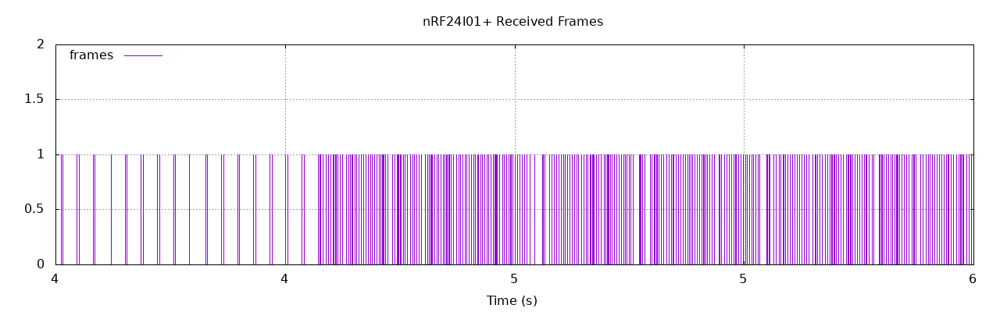

*Cette attaque correspond au travail très bien décrit [ici](https://blog.ptsecurity.com/2016/06/phd-vi-how-they-stole-our-drone.html)*

# Sniffing SDR

On va commencer par le plus simple: caractériser la liaison radio avec le drone éteint et la télécommande en mode recherche (avant l'appairage).


On va parcourir la bande de fréquence entre 2.400 GHz et 2.525 Ghz avec Gnuradio. Cela correspond à la plage de fréquences gérables par un nRF24l01 (la puce que l'on souhaite utiliser pour prendre le controle du drone).


Pour cela on crée une waterfall et on voit de l'activité autour **2.410 GHz**. Pour préciser notre observation, on fait une FFT avec Gnuradio autour de cette fréquence. Après avoir bien centré notre FFT, on voit une **bande passante autour de 800kHz**.

Si on regarde un extrait de la spec du nRF24l01, on peut lire:

```
6.3 RF channel frequency
------------------------

The RF channel frequency determines the center of the channel used by the nRF24L01+. The channel occupies a bandwidth of less than 1MHz at 250kbps and 1Mbps and a bandwidth of less than 2MHz at 2Mbps. nRF24L01+ can operate on frequencies from 2.400GHz to 2.525GHz. The programming resolu-
tion of the RF channel frequency setting is 1MHz.

At 2Mbps the channel occupies a bandwidth wider than the resolution of the RF channel frequency setting. To ensure non-overlapping channels in 2Mbps mode, the channel spacing must be 2MHz or more. At 1Mbps and 250kbps the channel bandwidth is the same or lower than the resolution of the RF frequency.

The RF channel frequency is set by the RF_CH register according to the following formula:

F0 = 2400 + RF_CH [MHz]

You must program a transmitter and a receiver with the same RF channel frequency to communicate with each other.
```

A supposer que le chipset du drone soit similaire à un nRF25l01, on voit qu'avec 800kHz de bande passante, on doit avoir **soit du 250Kbps, soit du 1MBps** mais ce n'est certainement pas du 2Mbps.

On utilise la formule pour trouver le canal: 2410 - 2400 = canal 10.

En faisant la même chose sur les autres fréquences, on voit de l'activité sur les canaux: **10, 31, 42, 66**

# Capture SDR

On va utiliser Gnuradio pour enregistrer les bits correspondants à notre payload.

Avant cela, on enregistre le signal brut dans un fichier qu'on ouvre avec baudline: on voit que ça a l'air d'être de la modulation GFSK.

Dans Gnuradio, on rajoute donc la démodulation et on constate dans baudline que le signal modulé est assez propre. On peut y lire un préambule "01010101" suivi de ce qui est probablement une adresse.

# Interprétation du protocole

On peut utiliser les [scripts python ou C d'analyse offline](https://github.com/chopengauer/nrf_analyze) qui existent déjà pour le RPI afin d'analyser le dump fait avec Gnuradio mais au final il est plus simple pour analyser en temps réel d'utiliser un nRF24l01+ sur un Raspberry Pi.

En se basant sur les mêmes scripts existants, on peut développer un outil qui affiche en temps réél les paquets reçus.

On voit alors que le protocole est très simple car les octets bougent quasiment de manière indépendantes. On conclut que le protocole est comme suit:
- Le préambule 0xAA
- L'adresse (Dans notre cas: 0xa1ca201670)
- La puissance (Octet 1): 0x00 - 0xFF
- Le tanguage (Octet 2):
  - Avant: 0x00 - 0x7F
  - Arrière: 0x80 - 0xFF
- Le roulis (Octet 3):
  - Gauche: 0x00 - 0x7F
  - Droite: 0x80 - 0xFF
- Le lacet (Octet 4):
  - Gauche: 0x00 - 0x7F
  - Droite: 0x80 - 0xFF
- Le mode (Octet 6):
  - High: 0xA0
  - Low: 0x20
- Des bits indépendants sur les 3 derniers octets de la fin pour la gachette droite et les trims
- Un CRC construit comme le XOR des 9 premiers octets auquel on ajoute 0x55

# Implémentation du protocole

Il est relativement simple d'implémenter le protocole en Python sur un RPi avec un module nRF24l01+.

On observe alors que si le drone est allumé mais que la télécommande ne l'est pas, le drone clignote et ne prends pas en compte nos commande. Il doit donc y avoir un appairage du drone et de la télécommande. Il faudrait creuser cet aspect mais pour réaliser l'attaque souhaitée, nous n'en avons pas besoin car nous souhaitons intercepter le drone en vol.

Si le drone est appairé avec sa télécommande originale, on observe que les ordres envoyés par le RPi l'emportent sur ceux de la télécommande: **L'attaque fonctionne**.

# Analyse de l'attaque

Le drone reçoit en fait des ordres valides à la fois de la télécommande et du RPi = nRF24l01+ prédateur. Comme tous les paquets sont valides de son point de vue, il essaye de satisfaire tous les ordres.

Cependant, avec le RPi et le nRF24l01+ nous avons la possibilité d'émettre plus de trames que la télécommande, le drone suit donc majoritairement les ordres de l'attaquant et en pratique son contrôle échappe au pilote légitime.


*L'attaque est visible lorsque la fréquence des trames augmente*

# Notes et Références

Si le drone ne se connecte plus bien à la télécommande, il existe une [procédure de reset](https://www.firstquadcopter.com/news/resetting-calibrating-Syma-x5c/).

- https://blog.ptsecurity.com/2016/06/phd-vi-how-they-stole-our-drone.html
- https://github.com/chopengauer/nrf_analyze
- https://github.com/goebish/nrf24_multipro/blob/master/nRF24_multipro/SymaX.ino
- Proakis Digital Communications (livre généraliste sur les télécommunications numériques, voir en particulier partie sur les enveloppes complexes et FSK/GFSK)